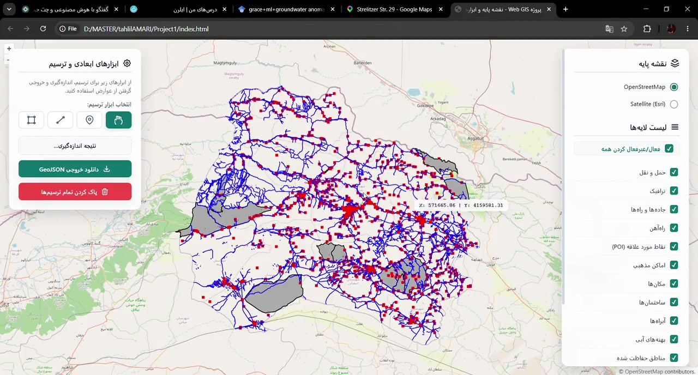

# Web-Based Geovisualization of Spatial Data

A four-part portfolio collection exploring 2D Web GIS, browser-based 3D models, CityGML visualization, and location-based WebAR.

> مجموعه‌ای چهارمرحله‌ای برای نمایش داده‌های مکانی دوبعدی، مدل‌های سه‌بعدی، داده‌های CityGML و واقعیت افزوده مکان‌محور در وب.

## Projects

| # | Project | Core technologies | Run mode |
|---|---|---|---|
| 01 | [2D Web Map](./01-2d-web-map/) | OpenLayers, GeoServer WMS, Proj4js | Local server + GeoServer |
| 02 | [X3D Web Model](./02-x3d-web-model/) | X3D, X3DOM, JavaScript | Static web server |
| 03 | [Cesium CityGML Viewer](./03-cesium-citygml-viewer/) | FME, CityGML, OGC 3D Tiles, CesiumJS | Static web server |
| 04 | [Location-Based WebAR](./04-location-based-webar/) | Leaflet, A-Frame, AR.js, Web APIs | HTTPS or localhost |

## Learning progression

```text
2D spatial layers → browser-based 3D → georeferenced 3D Tiles → location-based augmented reality
```

### 01 — 2D Web Map



[Watch the optimized demonstration video](./01-2d-web-map/assets/demo.mp4)

An OpenLayers interface for switching basemaps, displaying GeoServer WMS layers, identifying features, and drawing spatial objects. The included demonstration video shows the local setup in action.

### 02 — X3D Web Model

A browser-based 3D viewer that loads an external X3D model with X3DOM. It includes predefined camera viewpoints, coordinate inspection, and an attribute panel.

### 03 — Cesium CityGML Viewer

A CityGML dataset was reprojected and converted to OGC 3D Tiles in FME, then visualized in CesiumJS. The viewer supports coordinate display, feature identification, and drawing tools.

### 04 — Location-Based WebAR

A mobile-first WebAR navigator. Users select a destination on a Leaflet map and view a GPS-anchored marker through the device camera, with live distance and compass guidance.

## Run locally

A local HTTP server avoids browser restrictions on model and tile loading:

```bash
python -m http.server 8000
```

Then open `http://localhost:8000`.

Project 01 additionally expects GeoServer at `http://localhost:8081/geoserver/wms`. Project 04 requires camera, location, and orientation permissions and must run on HTTPS or localhost.

## GitHub Pages

1. Upload this repository to GitHub.
2. Open **Settings → Pages**.
3. Select **Deploy from a branch**.
4. Choose the `main` branch and `/ (root)`.

Projects 02–04 can be served as static pages. Project 01 opens publicly, but its local WMS layers only load when the configured GeoServer is available.

## Data and licensing note

The code is shared for portfolio and educational review. Before making the repository public, confirm that every source dataset, model, texture, basemap service, and FME workspace may be redistributed. No open-source license is included yet.

## Author

**Faezeh Sadeghi Niestanak**  
Geospatial Researcher · M.Sc. Student in Remote Sensing, University of Tehran
